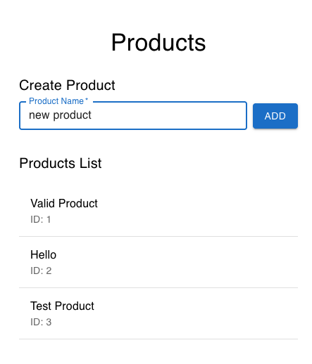

# Products App

A minimal end-to-end web application consisting of a React frontend, a Node Hapi backend in TypeScript, and a local PostgreSQL database container.

---

## Prerequisites

- Node (24.18, defined in `.nvmrc`)
- npm
- Docker to run Postgres

---

## Database setup

Use Docker Compose to run a local Postgre container and Prisma to manage schema migrations.

1. Start the PostgreSQL database container:
   
   From the `server/`, run:
   ```bash
   docker compose up -d
   ```

2. Run database migrations:
   Run the Prisma migration command to create the `products` table and generate the local client:
   ```bash
   npx prisma migrate dev --name init
   ```

## Start backend

The backend is built with Node Hapi in TypeScript

1. Install dependencies:
   ```bash
   npm install
   ```

2. Start the backend server in development mode:
   ```bash
   npm run dev
   ```
   The backend server will start and listen on [http://localhost:5001](http://localhost:5001).

---

## Start frontend

The frontend is a React app listing products and allowing new product creation.

1. Install dependencies:
   ```bash
   npm install
   ```

2. Start the React dev server:
   ```bash
   npm start
   ```
   The frontend application will start and open in your browser on [http://localhost:3000](http://localhost:3000).

---

## Verify



---

## Notes

### Deviations from the Preferred Stack

Replaced Java Spring Boot with Node (Hapi) in TypeScript
Used Prisma to define and generate migrations

### Why the deviations?

- I am more familiar and comfortable working with TypeScript, Node, and Hapi from day to day experience

